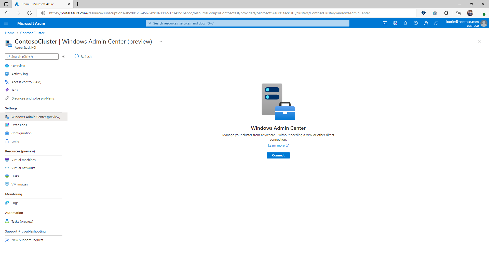

[wacfirewallruleshost]:https://learn.microsoft.com/en-us/azure-stack/hci/concepts/firewall-requirements#windows-admin-center
[wacfirewallrulesinternet]:https://learn.microsoft.com/en-us/windows-server/manage/windows-admin-center/deploy/network-requirements#gateway-urls
[wacfirewallrulesbrowser]:https://learn.microsoft.com/en-us/windows-server/manage/windows-admin-center/deploy/network-requirements#browser-urls
[wacdeploymentoptions]:https://learn.microsoft.com/en-us/windows-server/manage/windows-admin-center/plan/installation-options
[wacportal]: https://learn.microsoft.com/en-us/windows-server/manage/windows-admin-center/azure/manage-hci-clusters
[wacportalfirewall]:https://learn.microsoft.com/en-us/windows-server/manage/windows-admin-center/azure/manage-hci-clusters#networking-requirements
[wcportalsubscription]:https://learn.microsoft.com/en-us/windows-server/manage/windows-admin-center/azure/manage-hci-clusters#azure-account-with-an-active-subscription
[wacportalpermissions]:https://learn.microsoft.com/en-us/windows-server/manage/windows-admin-center/azure/manage-hci-clusters#azure-permissions
[sconfig]:https://learn.microsoft.com/en-us/windows-server/administration/server-core/server-core-sconfig
[get-storagejob]:https://learn.microsoft.com/en-us/powershell/module/storage/get-storagejob?view=windowsserver2022-ps
[get-virtualdisk]:https://learn.microsoft.com/en-us/powershell/module/storage/get-virtualdisk?view=windowsserver2022-ps
[new-volume]:https://learn.microsoft.com/en-us/azure-stack/hci/manage/create-volumes#example-with-1-to-3-servers

# Welcome Kit - Azure Stack HCI - Management - Draft

Welcome to the "Azure Stack HCI - Management Welcome Kit." This comprehensive guide is designed to provide you with essential insights into the areas of focus and consideration when managing your Azure Stack HCI Monitoring. As part of your preparation before engaging with Microsoft engineers, this resource aims to demystify these technologies, offering clear explanations and answers to frequently asked questions. Whether you're new to these concepts or seeking to deepen your understanding, this Welcome Kit is your stepping stone to navigating the world of modern cloud-native solutions. 

## Management Options

As Azure Stack HCI is a hybrid solution we can management the cluster through a mix of on-prem and cloud tools.  Some of these tools you will be familiar with but other you may not be.  These management options are a choice, or combination of the following:

- Windows Admin Centre
- Windows Admin Centre in the Azure Portal (Preview)
- Remote Server Administration Tools (RSAT)
   - Windows Failover Cluster Manager
   - Hyper-V Manager
- PowerShell

Each of these tools can provide a varying degree of functionality and the choice of tool can depend on your experience and requirements.

### Windows Admin Centre

Windows Admin Center (WAC) is a application which can be installed on a Desktop or Server operating system and provides a graphical user interface for common tasks and action but also the ability to see performance data about the clusters and servers it manages.  The most common deployment locations we see for WAC is either on a separate server or workstation on the same site as the cluster, or in a central location, such as Azure, which had line of sight to the clusters it needs to manage using with VPN's or Express Route.

When [deploying WAC][wacdeploymentoptions] there are options to either have this as a standalone instance or make this highly available.

There are a series of extensions which are available for the management, which are updated on a regular basis and it is advised that where possible you allow these to update automatically.  3rd party extensions are also available and the common one used at the extensions released by the hardware vendor which allows for the management and updating of the hardware but also used the Cluster Aware Updating (CAU) functionality to allow these updates to be none service impacting.

Additionally Windows Admin Centre can be used to manage multiple Azure Stack HCI Clusters, but also Windows Servers not only running on Azure Stack HCI but in other locations.

When using Windows Admin Centre there are 3 sets of firewall rules needed. these are:

- The [gateway to the internet][wacfirewallrulesinternet], this will be the server which Windows Admin Centre is installed onto 
- The [browser to the internet][wacfirewallrulesbrowser], this is the machine which the Windows Admin Centre is being access from
- [Windows Admin Centre server to the nodes][wacfirewallruleshost], this will be the server which Windows Admin Centre is installed onto

### Windows Admin Centre in the Azure Portal (Preview)

As with Windows Admin Centre, [Windows Admin Centre in the Azure Portal][wacportal] can provide provides a graphical user interface for common tasks and action but also the ability to see performance data about the clusters and servers it manages.  It is deployed and accessed from from the Azure Portal via the installation of an extension which installed onto each of the nodes and does not require a private connection back to the Azure Portal, or any firewall security/NAT rules inbound.  It does require [outbound firewall rules][wacportalfirewall], allowing the similar functionality, but does not provide the option to install additional.  When this is enabled it required the node to be Arc Enabled, which they are are now be default, and also relevant [resource providers registration][wcportalsubscription]and  [permissions][wacportalpermissions] for the subscription.

With Windows Admin Centre in the Azure Portal the relation ship between the Windows Admin Centre in the Azure Portal instance and an HCI Cluster is 1-to-1, but each cluster can have its own instances associated with it, this is accessed as a .  Unlike Windows Admin Centre there is no option to select which extensions are installed, or to manage Windows Servers.

Once enabled this is accessed via the Azure Stack HCI blade within the Azure Portal, and will require additional authentication with a ADDS Account.

Additionally when this is enabled, the nodes directly can be managed from the Azure Portal from the Arc for Servers blade for each nodes, and will require additional authentication with a ADDS Account.

### Remote Server Administration Tools (RSAT)

Many server administrator will be very accustomed to the use of the Remote Server Administration Tools (RSAT), the primary 2 which can be used for the management of Azure Stack HCI are Windows Failover Cluster Manager and Hyper-V Manager

### PowerShell

As Azure Stack HCI is a core operating system, with node GUI, then the first steps of the configuration needs to be complete via command line/PowerShell, things like setting IP addresses, joining the domain etc.  Azure Stack HCI does include [SConfig][sconfig] which can provide a menu driven approach to many of the common administration tasks.

It would be recommended to familiarize yourself with the some of the administration tasks of Azure Stack HCI from a PowerShell perspective as this allows for these tasks to become semi or even fully automated, but also Windows Admin Centre can not always provide a full set of options when looking to run a command.  Some of the would be:

- [get-storagejob][get-storagejob] - to list any repairs or other jobs running on volumes, which is useful during or after any maintenance work
- [get-virtualdisk][get-virtualdisk] - to see the current status of volumes, which is useful during or after any maintenance work
- [new-volume][new-volume] - to create new volumes on the cluster

As you look through the documentation there is almost always steps of how to perform these tasks using PowerShell along side the steps of how to do the same tasks via Powershell.