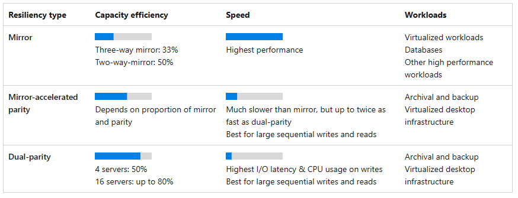
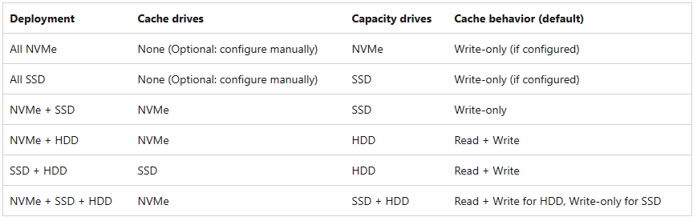
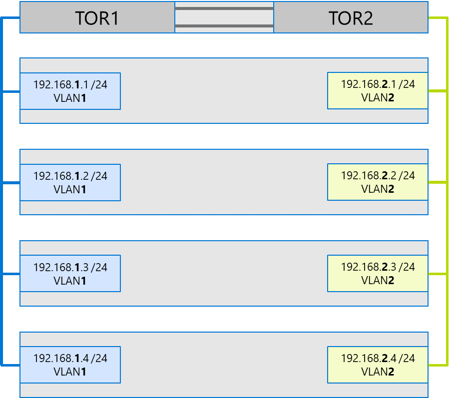
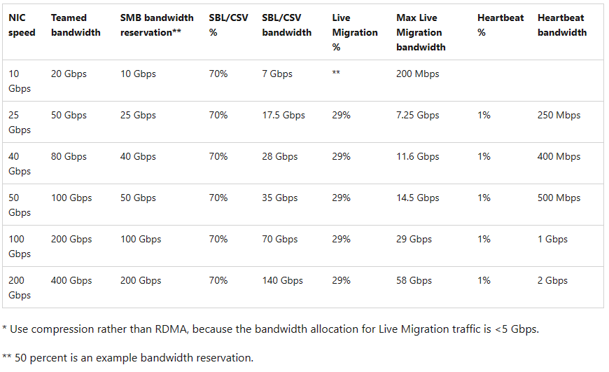

[catalog]:https://azurestackhcisolutions.azure.microsoft.com/#/catalog
[switchrequirements]:https://learn.microsoft.com/en-us/azure-stack/hci/concepts/physical-network-requirements?tabs=overview%2C22H2reqs#network-switch-requirements
[requiredrules]:https://learn.microsoft.com/en-us/azure-stack/hci/concepts/firewall-requirements#required-firewall-urls
[recommendedrules]:https://learn.microsoft.com/en-us/azure-stack/hci/concepts/firewall-requirements#required-firewall-urls
[additionalrules]:https://learn.microsoft.com/en-us/azure-stack/hci/concepts/firewall-requirements#firewall-requirements-for-additional-azure-services
[internalrules]:https://learn.microsoft.com/en-us/azure-stack/hci/concepts/firewall-requirements#firewall-requirements-for-internal-rules-and-ports
[azurerequirements]:https://learn.microsoft.com/en-us/azure-stack/hci/concepts/system-requirements?tabs=azure-public#azure-requirements
[validatedswitched]:https://learn.microsoft.com/en-us/azure-stack/hci/concepts/physical-network-requirements?tabs=overview%2C22H2reqs#network-switches-for-azure-stack-hci
[enviromentchecker]:https://learn.microsoft.com/en-us/azure-stack/hci/manage/use-environment-checker?tabs=connectivity
[sdnoverview]:https://learn.microsoft.com/en-us/azure-stack/hci/concepts/software-defined-networking
[dcfirewall]:https://learn.microsoft.com/en-us/azure-stack/hci/concepts/datacenter-firewall-overview
[sdnphased]:https://learn.microsoft.com/en-us/azure-stack/hci/concepts/plan-software-defined-networking-infrastructure#phased-deployment
[hardwarerequirements]:https://learn.microsoft.com/en-us/azure-stack/hci/concepts/plan-software-defined-networking-infrastructure#sdn-hardware-requirements
[clusterquorum]:https://learn.microsoft.com/en-us/azure-stack/hci/concepts/quorum#cluster-quorum-overview
[clusterquorumexamples]:https://learn.microsoft.com/en-us/azure-stack/hci/concepts/quorum#examples
[cloudwitness]:https://learn.microsoft.com/en-us/azure-stack/hci/manage/witness
[wacwitness]:https://learn.microsoft.com/en-us/azure-stack/hci/manage/witness#create-a-cloud-witness-using-windows-admin-center
[powershellwitness]:https://learn.microsoft.com/en-us/azure-stack/hci/manage/witness#create-a-cloud-witness-using-windows-powershell
[poolwintessexamples]:https://learn.microsoft.com/en-us/azure-stack/hci/concepts/quorum#pool-quorum-overview
[reservedcapacity]:https://learn.microsoft.com/en-us/azure-stack/hci/concepts/plan-volumes#reserve-capacity
[s2doverview]:https://learn.microsoft.com/en-us/azure-stack/hci/concepts/storage-spaces-direct-overview
[s2dslabs]:https://techcommunity.microsoft.com/t5/storage-at-microsoft/deep-dive-the-storage-pool-in-storage-spaces-direct/ba-p/425959
[Twowaymirror]:https://learn.microsoft.com/en-us/azure-stack/hci/concepts/fault-tolerance#two-way-mirror
[threewaymirror]:https://learn.microsoft.com/en-us/azure-stack/hci/concepts/fault-tolerance#three-way-mirror
[parity]:https://learn.microsoft.com/en-us/azure-stack/hci/concepts/fault-tolerance#parity
[singleparity]:https://learn.microsoft.com/en-us/azure-stack/hci/concepts/fault-tolerance#single-parity
[dualparity]:https://learn.microsoft.com/en-us/azure-stack/hci/concepts/fault-tolerance#dual-parity
[mirroraccelerateoairty]:https://learn.microsoft.com/en-us/azure-stack/hci/concepts/fault-tolerance#mirror-accelerated-parity
[storageefficiency]:https://learn.microsoft.com/en-us/azure-stack/hci/concepts/fault-tolerance#resiliency-types
[storageminimumnodes]:https://learn.microsoft.com/en-us/azure-stack/hci/concepts/fault-tolerance#minimum-scale-requirements
[allflashpool]:https://learn.microsoft.com/en-us/azure-stack/hci/concepts/cache#all-flash-deployment-possibilities
[hybridpool]:https://learn.microsoft.com/en-us/azure-stack/hci/concepts/cache#hybrid-deployment-possibilities
[cachediskratio]:https://learn.microsoft.com/en-us/azure-stack/hci/concepts/cache#drive-bindings-are-dynamic
[cachebehavior]:https://learn.microsoft.com/en-us/azure-stack/hci/concepts/cache#cache-behavior-is-set-automatically
[windowservercatalog]:https://www.windowsservercatalog.com/
[managementstandard]:https://www.windowsservercatalog.com/content.aspx?ctf=AQinfo-network-adapters-management.htm
[computestandard]:https://www.windowsservercatalog.com/content.aspx?ctf=AQinfo-network-adapters-compute-standard.htm
[storagestandard]:https://www.windowsservercatalog.com/content.aspx?ctf=AQinfo-network-adapters-storage-premium.htm
[setswitches]:https://learn.microsoft.com/en-us/windows-server/networking/technologies/hpn/hpn-software-only-features#switch-embedded-teaming-set
[symmetricalnics]:https://learn.microsoft.com/en-us/azure-stack/hci/concepts/host-network-requirements#switch-embedded-teaming-set
[networkatc]:https://learn.microsoft.com/en-us/azure-stack/hci/deploy/network-atc?tabs=22H2
[fullyconverged]:https://learn.microsoft.com/en-us/azure-stack/hci/deploy/network-atc?tabs=22H2#fully-converged-intent
[computeandstorage]:https://learn.microsoft.com/en-us/azure-stack/hci/deploy/network-atc?tabs=22H2#converged-compute-and-storage-intent-separate-management-intent
[fullydisaggregated]:https://learn.microsoft.com/en-us/azure-stack/hci/deploy/network-atc?tabs=22H2#fully-disaggregated-intent
[managementandcompute]:https://learn.microsoft.com/en-us/azure-stack/hci/deploy/network-atc?tabs=22H2#compute-and-management-intent
[switchedstorage]:https://learn.microsoft.com/en-us/azure-stack/hci/concepts/physical-network-requirements?tabs=overview%2C22H2reqs#using-switches
[switchlessstorage]:https://learn.microsoft.com/en-us/azure-stack/hci/concepts/physical-network-requirements?tabs=overview%2C22H2reqs#using-switchless
[smbmultichannel]:https://learn.microsoft.com/en-us/azure-stack/hci/manage/manage-smb-multichannel
[netatcoverrides]:https://learn.microsoft.com/en-us/azure-stack/hci/manage/manage-network-atc?tabs=21H2#update-or-override-network-settings
[livemigrateqos]:https://learn.microsoft.com/en-us/powershell/module/smbshare/set-smbbandwidthlimit?view=windowsserver2022-ps#example-2-add-an-smb-limit-for-live-migration

# Welcome Kit - Azure Stack HCI - Planning - Draft

Welcome to the "Azure Stack HCI - Planning Welcome Kit." This comprehensive guide is designed to provide you with essential insights into the areas of focus and consideration when planning and designing your Azure Stack HCI Deployment. As part of your preparation before engaging with Microsoft engineers, this resource aims to demystify these technologies, offering clear explanations and answers to frequently asked questions. Whether you're new to these concepts or seeking to deepen your understanding, this Welcome Kit is your stepping stone to navigating the world of modern cloud-native solutions. 

## Requirements

As Azure Stack is a Hybrid Solution then this touches a number of areas which normal Azure Deployments don't and in turn touches areas which a traditional on-premises would not. In the following sections the requirements across both will be discussed.

### Host Hardware Requirements

With Azure Stack HCI there are 2 options when selecting the hardware to use as part of the deployment. Working with a Hardware OEM they can provide either a Validated or an Integrated system. With the Validate System all the hardware has been tested and validated to support Azure Stack HCI and will be delivered just as the base hardware and will require the firmware, operating system and drivers to be installed by the customer/partner. With the Integrated System again the hardware has been tested and validated to support Azure Stack HCI but with these systems the firmware, operating system, and drivers to be pre-installed.

Details about the these systems is available within the [HCI Catalog][catalog] and can be used as a foundation to go into the discussions with Hardware OEM's to find the correct hardware for your requirements.

### Network Switch Requirements

As Azure Stack HCI is a hyper-converged platform the physical network which links the nodes together and to the rest of the network are very important to help deliver the performance and availability required.  Depending on the purpose of the of the switch, whether it be dedicated for management, storage or compute, or indeed for multiple of these roles then they need to support certain [industry standards][switchrequirements].

Additionally, certain switch vendors have worked with Microsoft to [validated their switches][validatedswitched] for each of these roles

Despite this list being available you are free to use any switch as long as it meets the requirements for the relevant role (e.g. for a switch used for the storage then all of the storage required standards are needed)

### Active Directory Requirements

As the Azure Stack HCI cluster is a Windows Failover Cluster Instance running Hyper-V and S2D then an Active Directory Domain Servers are required. Additional once the cluster is deployed it is advised to grant the cluster computer object permissions to the OU which the nodes and cluster computer object are within. This is needed to allow for the creation and modification to AD objects when roles and services are deployed on the cluster. Also it would be recommended to disabled GPO inheritance and then only apply the GPO's specific to Azure Stack HCI.

Sometimes these types of changed are not appropriate so there is the option to use a fabric domain which will allow more "flexibility" to these changes as it is limited to your Azure Stack HCI cluster(s).

The final point around the AD requirements is that AD is required to allow the cluster to actually start so this means that, domain controllers can run on the Azure Stack HCI cluster there needs to be Domain Controllers reachable from the nodes when they boot.

### Azure Requirements

Azure Stack HCI required to be registered with an Azure subscription and then synchronize with Azure at a minimum of every 28 days to allow full cluster functionality. The [registration requirements][azurerequirements] are only certain regions are supported, these regions only hold "metadata" about your cluster and no data from the service running on Azure Stack HCI is stored in this region.

### Firewall Requirements

As part of the hybrid capabilities of Azure Stack HCI then there are required to be a number of firewall ports and addresses which need to be allow. The following documents list out those that are required, recommended and those for additional services such as AKS, ARC VM Management, etc

-   [Required Rules][requiredrules]

-   [Recommended Rules][recommendedrules]

-   [Additional Services][additionalrules]

In addition to these firewall rules for the outbound internet access there are [rules required for internal traffic flows][internalrules], such as between nodes and with management machines, DC's etc. 

## Environment Validation

Once the all of the above requirements are met then they can be validated using the [Environment Checker][enviromentchecker] can then be used to validate the following:

-   **Connectivity validator**. Checks whether each server in the cluster meets the connectivity requirements. For example, each server in the cluster has Internet connection and can connect via HTTPS outbound traffic to well-known Azure endpoints through all    firewalls and proxy servers.

-   **Hardware validator**. Checks whether your hardware meets the system requirements. For example, all the servers in the cluster have the same manufacturer and model.

-   **Active Directory validator**. Checks whether the Active Directory preparation tool is run prior to running the deployment.

-   **Network validator**. Validates your network infrastructure for valid IP ranges provided by customers for deployment. For example, it checks there are no active hosts on the network using the reserved IP range.

-   **Arc integration validator**. Checks if the Azure Stack HCI cluster meets all the prerequisites for successful Arc onboarding.

## Quorum

To allow for the Windows Failover Cluster to function, the quorum is the mechanism which determines the viability of the cluster avaialbility and is used to determin action in the event of any failures, whether they be host, network or storage.  There are 2 types of quroum to consider when planning Azure Stack HCI and these are the Cluster Quorum and the Storage Pool Quorum.

### Cluster Quorum

The Cluster Quorum it is advised that when having particular number of nodes is to have a [witness][clusterquorum] which can provide the an additional "vote" to determine the actions performed in the event of a failure.  The [expected outcome][clusterquorumexamples] when one or node fail or is unresponsive differs based on the number of nodes and the presence of a witness.

The witness can is traditionally a file share which needs to be contactable by all nodes and will be referenced in the change of the cluster "state".  There are 2 option for the file share witness:

-   **SMB file share** is a file share is referenced by UNC Path and each of the cluster nodes needs to have access to the UNC path using the Cluster Computer Object.  The file share should be hosted from a location which is available even with the partial failure of some of the nodes, and not on the Azure Stack HCI Cluster itself
-   **Cloud Witness** is a storage account [hosted in Azure][cloudwitness] which can be accessible over the internet or via a private endpoint but again should be access by all nodes in the cluster, the access is grant to this with the used if the endpoint URL and the access key.

Setting of of the witness can be complete using with [WAC][wacwitness] or [PowerShell][powershellwintess]

### Storage Pool Quorum

The Storage Pool Quorum works independently from the Cluster Quorum as this is designed for clustered and none cluster environment.  Depending on the number of nodes in the system and the presence of a witness dictates the [expected outcome][poolwintessexamples].  Each disk which makes up the storage pool has a vote towards establish quorum of the pool.  It is recommended that each node in your cluster is symmetrical (each node has the same number of drives), and in the event that this is an even number then the owner of the storage pool will also receive a vote to help establish this.

The requirement for the pool to remain in quorum (online) is that 50% + 1 of the votes should be available.  An additional considering is with cluster with 5 nodes or more is that if more than two nodes are down, or two nodes and a disk on another node are down, volumes may not have access to all three copies of their data, and therefore be taken offline and be unavailable. It's recommended to bring the servers back or replace the disks quickly to ensure the most resiliency for all the data in the volume.  This can be helped with the following of the guidelines for the [reserved capacity][reservedcapacity] as this will allow the capacity for data on failed disks to be written to the reserved space.

## Storage

The storage for Azure Stack HCI is built using [Storage Space Direct (S2D)][s2doverview] and pools all of the capacity disk within a cluster into a storage pool and then volumes are created within that pool using one of the support resiliency types.  the data is the broken down into [slabs][s2dslabs] and then distributed across all disks within the storage pool, ensure that the slabs are located in adherence with the resiliency type for the volume.  It also has the ability to have a caching tier which can help increase performance by having a higher speed disk used for caching and then slower disks for the actual capacity storage.

### Storage Resiliency and Fault Tolerance

Within Azure Stack HCI there are the following levels of resiliency:

- [Two-way Mirror][Twowaymirror]
- [Three-way Mirror][threewaymirror]
- [Parity][parity]
  - [Single Parity][singleparity]
  - [Dual Parity][dualparity]
  - [Mirror-accelerated parity][mirroraccelerateoairty]

Depending on the level of resiliency select then the [storage efficiency][storageefficiency] and [number of nodes][storageminimumnodes] required will change, as well as the potential performance and use cases.

### Storage Pool Cache

When creating a storage pool there are 2 types for the storage pool which are based on the types of disks.  These are [all flash][allflashpool] and hybrid [hybridpool].  With a all flash pool then this can be all SSD, all NVMe or a mix of these 2 types.  If there is a mix of these types then the faster disk will be selected and used as the cache tier and these will not be used towards the capacity of the storage pool.  If the storage pool is made up HDD's then there also need to be SSD's and/or NVMe's to provide the caching tier.

When sizing the cache disks it is advised to have the number of cache disks to be [a multiple of the capacity disks][cachediskratio].  The allocation of the cache disks to the capacity disks is dynamic and will adjust accordingly if disks are added or removed, or fail.

The [cache behavior][cachebehavior] is determined by the storage pool type with All Flash using the cache for writes but not reads, where as the Hybrid type cache is used for both reads and writes.

## Network Topology

Due to the Hyper-Converged cluster which Azure Stack HCI the network is not only used for management and workload traffic but also for both replication and access to the storage.  Within Azure Stack HCI the 4 traffic types are:

- Management - this is the traffic for this like authentication, cluster heart beats, witness access and OS management of the node
- Compute - this is the traffic which is from the workloads running on the cluster
- Storage - this is the traffic which is the the replication of the data between the nodes and also the the traffic to access the storage.  Each volume will have an "owner" and then any access to that volume will go via that node
- Replica - this is the traffic used with stretched clusters, and is the storage replica traffic between the 2 storage pools in the stretch cluster 

Each of these types of traffic has different requirements and it needs to be ensured that the network interfaces being used for each of these traffic types is support.  This can be checked in the [Windows Server Catalog][windowservercatalog], and it can be seen that the standards available are [management][managementstandard], [compute][computestandard] and [storage][storagestandard].

It is possible to use a single network interface for multiple purposes and also to have multiple interfaces teamed using the [Switch Embedded Teaming (SET) switches][setswitches], and this is the only supported teaming with Azure Stack HCI.  With SET switches it is required that network adapters across the SET switches and nodes are [symmetrical][symmetricalnics], this is down to make, model, speed and configuration (including driver and firmware).  This is one of the checks which [Network ATC][networkatc] checks when it is configured, and Network ATC is the recommended approach for network configuration as simplifies the deployment and network configuration management for Azure Stack HCI clusters.

### Network Design Patterns

As mentioned above there are a number of different network design patterns which can be following which include:

- [Fully Converged][fullyconverged] where compute, storage, and management networks are on on the same SET Switch, with virtual interfaces for the management and storage interfaces
- [Compute with Storage][computeandstorage] where compute and storage are on one SET switch, and management is on another SET Switch with virtual interfaces for the management and storage interfaces
- [Fully Disaggregated][fullydisaggregated] where compute has its own SET switch, management has its own SET switch with a virtual interface for management and the storage interface are standard physical interfaces
- [Management with Compute][managementandcompute] where compute and management are on one SET switch with a virtual interface for management and the storage interface are standard physical interfaces

**Storage Traffic/Network**
With regards to the storage traffic then there are again 2 options with regard to connectivity and these are [switched][switchedstorage] and [switchless][switchlessstorage].  Switchless Storage networks requires the connection, back-to-back, of the storage interfaces which means that this does rule out some of the deployment patterns listed above as they need to be physical interfaces.  This can help the reduction of cost of the top of rack switches needed as they will not need to support the storage standards but when going beyond 3 nodes in a cluster the benefit is quickly diminished due to the additional more complex cabling and the recommendation of having 2 resilient connections for storage, means for every node needs to links to every other node in the cluster, e.g a 3 node cluster would need 4 storage interfaces per node, a 4 node cluster would need 6 storage interfaces per node, compared to switched storage networks which only every require a minimum of 2 storage interfaces to provide the resiliency.

Another consideration for the storage traffic is bandwidth.  It is recommended that for the storage interfaces they should be a minimum of 10gb, but if the storage interfaces are shared (like the Fully Converged and Compute with Storage above) or there are 3 nodes or more then the recommended is a minimum of 25gb.  This is even more apparent when the storage is NVMe is used as you would not want the network to be the bottleneck.

With 2 storage networks this allows for the use of [SMB Multichannel][smbmultichannel] to provide aggregation of network bandwidth and network fault tolerance.  For this configuration it is advised to have each of the storage networks using different IP networks and VLANS.

**Bandwidth Allocation**

When using any converged networking it is important to ensure that the different traffic types have the required amount of bandwidth available.  When using [Network ATC][networkatc] there are some standard reservation put into place which are:

- 50% for Storage/SMB Traffic
- 1% for cluster heartbeat traffic
- Remaining available for all other traffic

These reservations are an example and they can be overridden with [QoS Overrides][netatcoverrides].  Additionally, consideration is needed for the live migration bandwidth.  The recommendation is that if the Live Migration traffic is <5 Gbps to use compression but for over this to use RDMA.  In both cases you would not want to over saturate the relevant network this should [also be limited][livemigrateqos].

Shown below is an example of the configuration which could be applied which would need a combination of Network ATC QoS Overrides and Live Migration Limits:

