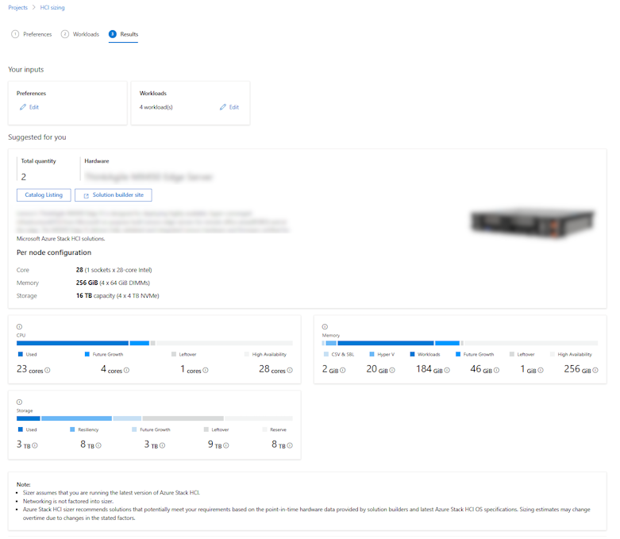
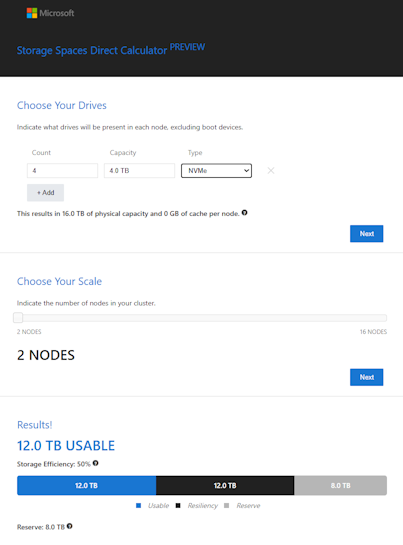

[NoSupportForRaidController]:https://learn.microsoft.com/en-us/azure-stack/hci/concepts/system-requirements-23h2#server-and-storage-requirements
[StorageStandard]:https://learn.microsoft.com/en-us/azure-stack/hci/concepts/host-network-requirements#rdma
[WindowsServerCatalog]:https://www.windowsservercatalog.com/
[NetworkSwitchRequirements]:https://learn.microsoft.com/en-us/azure-stack/hci/concepts/physical-network-requirements?tabs=overview%2C23H2reqs#network-switches-for-azure-stack-hci
[HCISizer]:https://azurestackhcisolutions.azure.microsoft.com/#/sizer
[S2Dcalc]:https://aka.ms/s2dcalc
[TibvsTB]:https://www.bing.com/search?pglt=515&q=tib+vs+tb
[WindowsOnHCI]:https://learn.microsoft.com/en-us/azure-stack/hci/manage/vm-activate?tabs=azure-portal

# 1 - planning: Infrastructure Setup and Integration

**Purpose:**
- Better understanding of AzStack HCI & Storage Spaces Direct (S2D) and its requirements 
- Where to go to find supported hardware
- know the planning tools available
- right-size the solution

## Quiz
Research to find the answers on the following questions:
- Your Azure Stack HCI cluster (23H2) can contain ___ to ___ nodes.
- Imagine your HCI cluster has 8 nodes. How many can fail before everything goes down? Would the resilience of this cluster rise when adding 2 nodes?
- What resiliency type would you chose for a volume hosting high performance VM workload? 
- Can you use dual parity for a volume in a cluster with 3 nodes?
- Nested resiliency provides a way to tolerate the outage of a disk plus another node go offline in a 2 node cluster - correct or wrong?
- What network traffic classes do I have on an AzStack HCI cluster?
- What does switchless for storage networks mean?

## Exercise 1: Assessing Your Current Infrastructure
Objective: Assess your current infrastructure to determine if it meets the requirements for Azure Stack HCI 23H2.  
Or in other words - Can I use my current HW for AzStack HCI?
a) Inventory your current hardware and software.
b) Compare your current infrastructure against the Azure Stack HCI 23H2 requirements. Watch out for:
- How is the servers local storage presented to the OS? (Raid Controller or **Host Bus Adapter**?) ---> [does HCI support RAID controllers?][NoSupportForRaidController]
- Do my network adapters support RDMA for high performance storage traffic? [RDMA for storage][StorageStandard] Can you find your adapter in the Windows Server Catalog? [WindowsServerCatalog][WindowsServerCatalog]
- Do I have the right switches?: Support RDMA Priority Flow Control (PFC), Enhanced Transmission Select (ETS).... [Network Switch Requirements][NetworkSwitchRequirements]

Here is how a minimal setup could look like:  
https://learn.microsoft.com/en-us/azure-stack/hci/plan/two-node-switchless-single-switch#physical-connectivity-components

## Exercise 2: Planning for Scalability and Performance
Objective: Plan your Azure Stack HCI 23H2 deployment for scalability and performance based on your organization's needs.

**Task 1:**
Estimate your organization's workload requirements by creating a table of VMs and its sizes e.g.:  

| Name | RAM (GB) | vCPU | Storage (GB) | OS | Purpose & Annotations (IOPS, Bandwith requirements, VLANID,...) | 
|--|--|--|--|--|--|
|  FS01| 16 | 8 | 128 + 500 | Win Srv 2016 | FServer user profiles 1 (60K8kIOPS, 10Gbit) |
|  VDI01| 8 | 4 | 128 | Win Srv 2012R2 | VDI-1 (10K8kIOPS, 1Gbit) |
|  VDI02| 8 | 4 | 128 | Win Srv 2012R2 | VDI-2 (10K8kIOPS, 1Gbit) |
|  FW01| 8 |6 | 96 | Ubuntu 22.04 | FWall (2x10Gbit) |
|  |  |  |  |  |

Determine the optimal configuration for storage, compute, and networking to meet these requirements.
Document a scalability plan that includes potential future growth.

**Task 2:**
Navigate to the [Azure Stack HCI Sizer][HCISizer] to create a project and enter the information you gathered from the previous excercise  

Questions:
- How many nodes does your cluster have?
- Is the storage using capacity devices and cache devices? Do you know the implications? (search for *S2D storage pool cache*)
- Could you still go for a storage-switchless setup to save costs (as not storage switch is required) ?
- Is your system overprovisioned? (Storage, Memory, Compute)

**Task 3:**
Let's use another tool to optimize the storage for our HCI cluster. Go to [Storage Spaces Direct Calculator][S2Dcalc] and enter the values (#disks, #capacity, #nodes) and see how your system could look like.  

Questions:
- What resilience are you using?
- What resilience is right for VM Workload?
- What is your storage efficiency?
- Have you been consistent? Or in other words: Don't gather your requirements in TiB (Tebibyte - windows) and then calculate in TB (Terrabyte - hardware) as you'll be ~10% short. [Tib vs. TB][TibvsTB]

## Exercise 3:  Cost Estimation and Optimization
Objective: Estimate the cost of deploying Azure Stack HCI 23H2 and explore ways to optimize spending.

**Task 4:**
- Use the Azure Pricing Calculator to estimate the cost of your Azure Stack HCI system. - How does physical Core Count impact the cost?
- Know the costs for the intended services to run ontop of HCI (e.g. Windows VMs, AVD, AKS,...)
- Identify potential areas for cost savings, such as hybrid benefits.
- For smaller clusters - would a switchless deployment for storage help you save costs?
- How would you [License Windows Server VMs on Azure Stack HCI][WindowsOnHCI]?

[🔼 hands-on-labs](../readme.md) | [2 - deployment ▶](../2%20-%20deployment/readme.md)