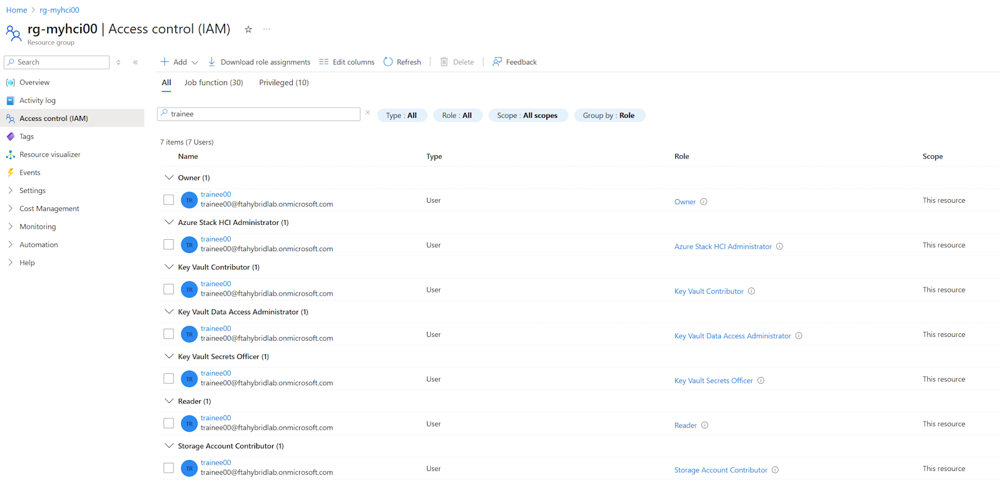

Question A: 
- What else did this deployment do? (hint - open the arm template and look into the *resources*)

Answer A:
*It was also assigning the required role assignments for the user on the resource group (based on principalid) to install Azure Stack HCI.*
