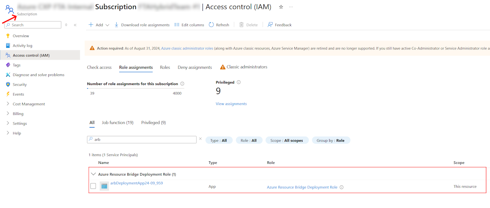
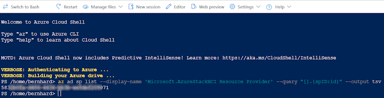
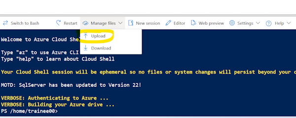
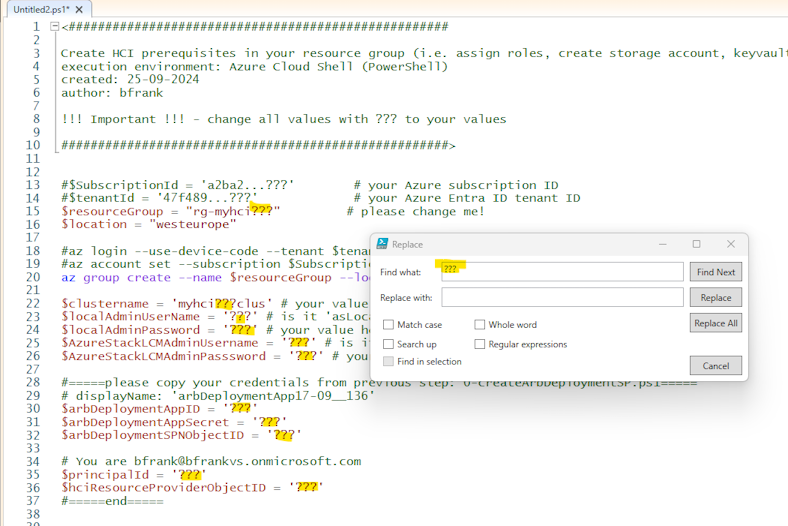
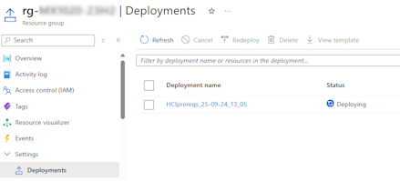
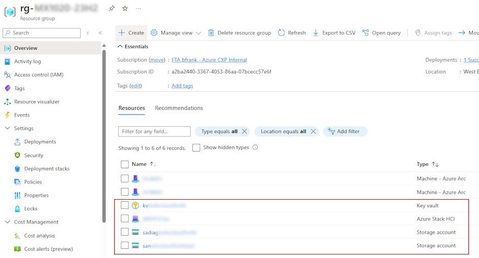

## ... pls do [steps 1 - 4a](../readme.md#1-prepare-active-directory) then come back here.
## 5. Deploy AzStack HCI using ARM templates
please 1st read [Deploy an Azure Stack HCI, version 23H2 via Azure Resource Manager deployment template](https://learn.microsoft.com/en-us/azure-stack/hci/deploy/deployment-azure-resource-manager-template)
as official reference.  

To sum it up you need to:  
1. Step: Prepare Azure resources
2. Step: Deploy using Azure Resource Manager template
 
### 1. Step: Prepare Azure resources  
as per [official Step 1: Prepare Azure resources](https://learn.microsoft.com/en-us/azure-stack/hci/deploy/deployment-azure-resource-manager-template#step-1-prepare-azure-resources)
you would need to **Create a service principal for ARB**  
>!!!However the documenation should mention to : **assign proper role permissions to this service principal at subscription level**. Otherwhise deployment may fail. e.g.:  


Next you need to [Get the **object ID for Azure Stack HCI Resource Provider**](https://learn.microsoft.com/en-us/azure-stack/hci/deploy/deployment-azure-resource-manager-template#get-the-object-id-for-azure-stack-hci-resource-provider)
This is required as parameter for the ARM deployment and IDs may be different in every subscription.  
You can run e.g. following code in your Cloud Shell (PowerShell) to retrieve the value:  
```PowerShell
az ad sp list --display-name 'Microsoft.AzureStackHCI Resource Provider' --query "[].{spID:id}" --output tsv
```  
The output should be something like:  
  

**Lucky you: In order to speed up things I have created a script that will do this automatically.**  
Pls go and execute [0-createArbDeploymentSP.ps1](../lab-armdeployment/artefacts/0-createArbDeploymentSP.ps1) in your Azure Cloud Shell (PowerShell).

### Step 2: Deploy using Azure Resource Manager template  
Despite from the ARM templates you may find for installing HCI - I modified them and split them into 2 files:
- [1-azStackPrereqs.json](../lab-armdeployment/artefacts/1-azStackPrereqs.json)
- [2-azStackDeployment.json](../lab-armdeployment/artefacts/2-azStackDeployment.json)  
 
I did so because I found it easier to understand when things happen. This should be redeployable i.e. if you need to restart because of typos, bad names, etc. you can delete resources in Azure first then redeploy.

#### a. Deploying the prerequisites and role permissions

**Upload** the [1-azStackPrereqs.json](../lab-armdeployment/artefacts/1-azStackPrereqs.json) to your Azure Cloud Shell (PowerShell)  
  
Then open [1-azStackPrereqs_deploy.ps1](../lab-armdeployment/artefacts/1-azStackPrereqs_deploy.ps1) in an editor and adjust to your values: e.g.  
  

And then kick it off by executing below from Cloud Shell:  
```PowerShell
az deployment group create  `
    --name $("HCIprereqs_" + ([datetime]::Now).ToString('dd-MM-yy_HH_mm')) `
    --template-file '1-azStackPrereqs.json' `
    --resource-group $resourceGroup `
    --parameters location=$location `
    principalId=$principalId  `
    clustername=$clustername `
    arbDeploymentAppID=$arbDeploymentAppID `
    arbDeploymentAppSecret=$arbDeploymentAppSecret `
    localAdminUserName=$localAdminUserName `
    localAdminPassword=$localAdminPassword `
    AzureStackLCMAdminUsername=$AzureStackLCMAdminUsername `
    AzureStackLCMAdminPasssword=$AzureStackLCMAdminPasssword `
    hciResourceProviderObjectID=$hciResourceProviderObjectID `
    tags=$('{""CreatedBy"": ""me"",""deploymentDate"": ""'+ $(([datetime]::Now).ToString('dd-MM-yyyy_HH-mm')) + '"",""Service"": ""HCI"",""Environment"": ""PoC""}')

```
You should be seeing the deployment take place in your resource group:  
  
once finished your resource group should contain the following similar items:  
  

**Question A:**
- What else did this deployment do?  
(hint - open the arm template and look into the *resources*)  
(answer can be found [here](./answers.md))


#### b. Validating and Deploying HCI
You may recall from your Azure portal wizard deployment of HCI that **there is a validation phase**. E.g. Network, HW, AD, will be checked.  
When deploying with an ARM template **you still need to perform this validation phase first**. After a successful run you do the deployment.  
For this **you can use the same ARM template**. The **parameter deploymentMode** will specify the phase you want to run i.e. Validate or Deploy:  

```json
...
        "deploymentMode": {
            "defaultValue": "Validate",
            "type": "string",
            "allowedValues": [
                "Validate",
                "Deploy"
            ],
            "metadata": {
                "description": "First must pass Validate prior running Deploy"
            }
        },
...
```
#### b.1. Run ARM template with Deployment Mode = Validate.  

Before you initiate the AzStack HCI deployment from e.g. Azure Cloud Shell (PowerShell) - you need to upload the [2-azStackDeployment.json](../lab-armdeployment/artefacts/2-azStackDeployment.json) template and its corresponding [2-azStackDeployment.parameters.json](../lab-armdeployment/artefacts/2-azstackdeployment.parameters.json) file.  
>!!! **Important Make sure you have updated the parameters file** (replace ??? with your values) to match your environment before uploading e.g.

(2-azstackdeployment.parameters.json)
```json
.
.
.
        "deploymentMode": {
            "value": "Validate"
        },
        "keyVaultName": {
            "value": "kv???"
        },
        "clusterWitnessStorageAccountName": {
            "value": "samyhci???"
        },
        "clusterName": {
            "value": "myhci???clus"
        },
        "nodeNames": {
            "value": [
                "???-hci-1",
                "???-hci-2"
            ]
        },
        .
        .
        .
```
Use e.g. this code in Cloud Shell (PowerShell) to kick off the validation:  
```PowerShell
$resourceGroup = "rg-myhci???"         # please change me!

az deployment group create  `
  --name $("HCI_validation_" + ([datetime]::Now).ToString('dd-MM-yy_HH_mm')) `
  --template-file '2-azStackDeployment.json' `
  --resource-group $resourceGroup `
  --parameters '2-azstackdeployment.parameters.json' 
```

#### b.2. Run ARM template with Deployment Mode = Deploy.
Once the validation has succeeded you can kick off the real deployment using the same parameter file.  
But overriding the parameter *deploymentMode* with '**Deploy**' e.g. by running:  
```PowerShell
  az deployment group create  `
  --name $("HCI_deployment_" + ([datetime]::Now).ToString('dd-MM-yy_HH_mm')) `
  --template-file '2-azStackDeployment.json' `
  --resource-group $resourceGroup `
  --parameters '2-azstackdeployment.parameters.json' --parameters deploymentMode='Deploy' 
```  
Now grab a coffee and lean back, this will take a while. 