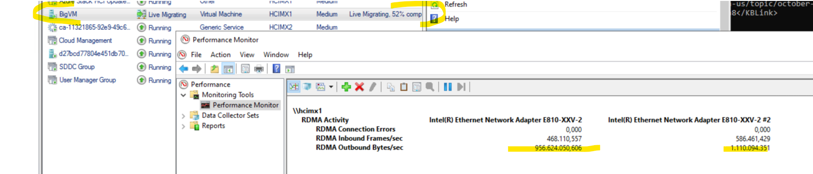

# 3 - governance:  Management and Migration

Management:  
- Azure Portal
- WAC (onpremise)
- WAC (Azure)
- PowerShell
- Failovercluster manager
- Hyper-V Manager
- SCVMM

## Get and modify Live migration bandwidth
To test RDMA or Live Migration you could e.g. **create a simple clustered VM with a lot of RAM** (e.g. > 64 GB, single vCPU, no network, no disk) **and live migrate the VM using Failover cluster manager**.  
To test RDMA traffic you can open perfmon with the RDMA activity counters in report view to validate its values:


*Q: Do you hit the ceiling? Or is there some limitation in place?*  
A: Yes there probably is. You can check if a limit has been set by issuing:  
```PowerShell
Get-SmbBandwidthLimit
```
The values have been calculated for your cluster. Just using Set-SmbBandwidthLimit might work only for a short time. As the settings are controlled by Network ATC.  

*Q: Can you set the bandwidth used for live migrations to a higher value?*  
A: Yes you can by defining an global cluster override value by:  
```PowerShell
$clusterOverride  = New-NetIntentGlobalClusterOverrides -MaximumVirtualMachineMigrations 2 -MaximumSMBMigrationBandwidthInGbps 20  # make sure the values make sense at your environment. Leave enough for storage RDMA
Set-NetIntent -GlobalClusterOverrides $clusterOverride  #Network ATC will run and make it so on all cluster nodes...this may take a while
```
You know when it is completed when `Get-NetIntentStatus -Globaloverrides` is displaying `"ProvisioningStatus  : Completed."`  
To get the overrides for all nodes you may do a:  
```PowerShell
$nodes = Get-NetIntentAllGoalStates
$nodes.GetEnumerator() | %{"-----$($_.Key)----";$_.Value.globalintent.Config.ClusterConfig.ClusterSettings}
```
Alternatively you can re-run `Get-SmbBandwidthLimit` it should now show the new value in Bytes/s


## Download A Marketplace Image.

## Creating A Logical Network

## Creating A Storage Path

## Create A VM On HCI Using The Azure Portal

## Use Azure Portal To Connect To The Console Of A VM

## Update AzStack HCI

## Enable / Validate HCI monitoring.

adding / repairing a disk.
adding / repairing a node.


[◀ 2 - deployment](../2%20-%20deployment/readme.md) | [🔼 hands-on-lab](../readme.md) | [4 - scenarios ▶](../4%20-%20scenarios/readme.md)