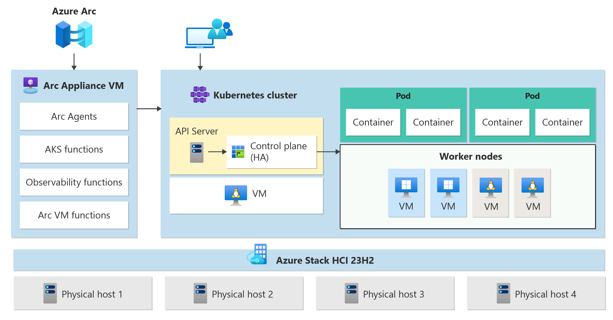
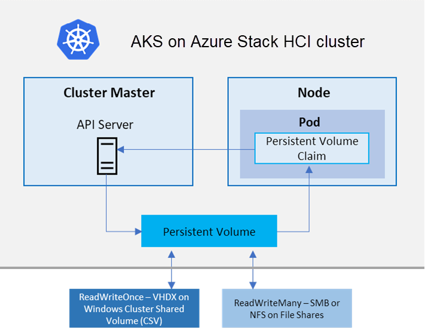

# What is AKS enabled by Azure Arc?

Azure Kubernetes Service (AKS) enabled by Azure Arc is a managed Kubernetes service that you can use to deploy and manage containerized applications on-premises, in datacenters, or at edge locations such as retail stores or manufacturing plants. You need minimal Kubernetes expertise to get started with AKS. AKS reduces the complexity and operational overhead of managing Kubernetes by offloading much of that responsibility to Azure. AKS is an ideal platform for deploying and managing containerized applications that require high availability, scalability, and portability. It's also ideal for deploying applications to multiple locations, using open-source tools, and integrating with existing DevOps tools.

## When to use AKS enabled by Azure Arc

The following list describes some of the common use cases for AKS, but is not an exhaustive list:

- **Hybrid cloud deployments**: Ideal for organizations looking to run applications across multiple environments, including on-premises and Azure, while maintaining a consistent management layer.
- **Edge computing**: Useful for deploying applications at the edge, where low latency and local processing are critical, such as in retail stores, manufacturing floors, or remote locations.
- **Regulatory and compliance**: Helps to meet specific regulatory and compliance requirements by enabling localized deployment and management of Kubernetes clusters.

## AKS enabled by Azure Arc deployment options

Azure provides you differernt options to install AKS enabled by Azure Arc Clusters. The below are the differrent environments that you can use : 

- **[AKS on Azure Stack HCI 23H2](https://learn.microsoft.com/en-us/azure/aks/hybrid/aks-whats-new-23h2)**: AKS on Azure Stack HCI 23H2 uses Azure Arc to create new Kubernetes clusters on Azure Stack HCI directly from Azure. It enables you to use familiar tools like the Azure portal and Azure Resource Manager templates to create and manage your Kubernetes clusters running on Azure Stack HCI.
- **[AKS Edge Essentials](https://learn.microsoft.com/en-us/azure/aks/hybrid/aks-edge-overview)**: AKS Edge Essentials includes a lightweight Kubernetes distribution with a small footprint and simple installation experience, making it easy for you to deploy Kubernetes on PC-class or "light" edge hardware.
- **[AKS on Windows Server](https://learn.microsoft.com/en-us/azure/aks/hybrid/overview)**: Azure Kubernetes Service on Windows Server (and on Azure Stack HCI 22H2) is an on-premises Kubernetes implementation of AKS that automates running containerized applications at scale, using Windows PowerShell and Windows Admin Center. It simplifies deployment and management of AKS on Windows Server 2019/2022 Datacenter and Azure Stack HCI 22H2.
- **[AKS on VMWare (preview)](https://learn.microsoft.com/en-us/azure/aks/hybrid/aks-vmware-overview)**: AKS on VMware (preview) enables you to use Azure Arc to create new Kubernetes clusters on VMware vSphere. With AKS on VMware, you can manage your AKS clusters running on VMware vSphere using familiar tools like Azure CLI.

# AKS on Azure Stack HCI 23H2 architecture

AKS clusters on Azure Stack HCI use Arc Resource Bridge (also known as Arc appliance) to provide the core orchestration mechanism and interface for deploying and managing one or more AKS clusters. Containerized applications are deployed into AKS clusters.

### Arc Resource Bridge

The Arc Resource Bridge connects a private cloud (for example, Azure Stack HCI, VMWare/vSphere, or SCVMM) to Azure and enables on-premises resource management from Azure. Azure Arc Resource Bridge provides the line of sight to private clouds required to manage resources such as Kubernetes clusters on-premises through Azure. Arc Resource Bridge includes the following core AKS Arc components:

- **AKS Arc cluster extensions**: A cluster extension is the on-premises equivalent of an Azure Resource Manager resource provider. Just as the **Microsoft.ContainerService** resource provider manages AKS clusters in Azure, the AKS Arc cluster extension, once added to your Arc Resource Bridge, helps manage Kubernetes clusters via Azure.
- **Custom location**: A custom location is the on-premises equivalent of an Azure region and is an extension of the Azure location construct. Custom locations provide a way for tenant administrators to use their data center with the right extensions installed, as target locations for deploying Azure service instances.

### AKS clusters

AKS clusters are a high availability deployment of Kubernetes using Linux VMs for running Kubernetes control plane components and Linux node pools. You can deploy additional Windows Server Core-based node pools for running Windows containers. There can be one or more AKS clusters managed by Arc Resource Bridge.

An AKS cluster has 2 major components, as described in the following sections.

#### Control plane nodes

Kubernetes uses control plane nodes to ensure every component in the Kubernetes cluster is kept in the desired state. The control plane also manages and maintains the worker node pools that hold the containerized applications. AKS enabled by Arc deploys the KubeVIP load balancer to ensure that the API server IP address of the Kubernetes control plane is available at all times. Microsoft does not charge you for control plane nodes, since control plane nodes do not host customer applications.

Control plane nodes run the following major components (not an exhaustive list):

- **API server**: Enables interaction with the Kubernetes API. This component provides the interaction for management tools, such as Azure CLI, the Azure portal, or kubectl.
- **Etcd**: A distributed key-value store that stores data required for lifecycle management of the cluster. It stores the control plane state.

#### Linux/Windows node pools

In Kubernetes, a node pool is a group of nodes within a cluster that share the same configuration. Node pools allow you to create and manage sets of nodes that have specific roles, capabilities, or hardware configurations, enabling more granular control over the infrastructure of your AKS cluster. You can deploy Linux or Windows node pools in your AKS cluster. However, you need to have at least 1 Linux nodepool to host the Arc agents to maintain connectivity with Azure.

# AKS enabled by Azure Arc network requirements

The below components need a static IP address in order for the AKS Arc cluster and applications to create and operate successfully:

- AKS cluster VMs
- AKS control plane IP
- Load balancer for containerized applications

## Networking for AKS cluster VMs

Kubernetes nodes are deployed as specialized virtual machines in AKS enabled by Arc. These VMs are allocated IP addresses to enable communication between Kubernetes nodes. AKS Arc uses Azure Stack HCI logical networks to provide IP addresses and networking for the underlying VMs of the Kubernetes clusters. For more information about logical networks, see [Logical networks for Azure Stack HCI](https://learn.microsoft.com/en-us/azure-stack/hci/manage/create-logical-networks?tabs=azurecli). You must plan to reserve one IP address per AKS cluster node VM in your Azure Stack HCI environment.

> [!NOTE]
> Static IP is the only supported mode for assigning an IP address to AKS Arc VMs. This is because Kubernetes requires the IP address assigned to a Kubernetes node to be constant throughout the lifecycle of the Kubernetes cluster.

## Control plane IP

Kubernetes uses a control plane to ensure every component in the Kubernetes cluster is kept in the desired state. The control plane also manages and maintains the worker nodes that hold the containerized applications. AKS enabled by Arc deploys the KubeVIP load balancer to ensure that the API server IP address of the Kubernetes control plane is available at all times. This KubeVIP instance requires a single immutable "control plane IP address" to function correctly.

> [!NOTE]
> The control plane IP is a required parameter to create a Kubernetes cluster. You must ensure that the control plane IP address of a Kubernetes cluster does not overlap with anything else, including Arc VM logical networks, infrastructure network IPs, load balancers, etc. The control plane IP also must be within the scope of the address prefix of the logical network, but outside the IP pool. This is because the IP pool is only used for VMs, and if you choose an IP address from the IP pool for the control plane, an IP address conflict can result. Overlapping IP addresses can lead to unexpected failures for both the AKS cluster and any other place the IP address is being used. You must plan to reserve one IP address per Kubernetes cluster in your environment.

## Load balancer IPs for containerized applications

The main purpose of a load balancer is to distribute traffic across multiple nodes in a Kubernetes cluster. This load balancing can help prevent downtime and improve overall performance of applications. AKS supports the following options to deploy a load balancer for your Kubernetes cluster:

- [Deploy MetalLB load balancer using Azure Arc extension](https://learn.microsoft.com/en-us/azure/aks/hybrid/deploy-load-balancer-portal).
- Bring your own third party load balancer.

Whether you choose the MetalLB Arc extension, or bring your own load balancer, you must provide a set of IP addresses to the load balancer service. You have the following options:

- Provide IP addresses for your services from the same subnet as the AKS Arc VMs.
- Use a different network and list of IP addresses if your application needs external load balancing.

Regardless of the option you choose, you must ensure that the IP addresses allocated to the load balancer don't conflict with the IP addresses in the logical network or control plane IPs for your Kubernetes clusters. Conflicting IP addresses can lead to unforeseen failures in your AKS deployment and applications.

## Simple IP address planning for Kubernetes clusters and applications

In the following scenario walk-through, you reserve IP addresses from a single network for your Kubernetes clusters and services. This is the most straightforward and simple scenario for IP address assignment.

| IP address requirement    | Minimum number of IP addresses | How and where to make this reservation |
|------------------|---------|---------------|
| AKS Arc VM IPs | Reserve one IP address for every worker node in your Kubernetes cluster. For example, if you want to create 3 node pools with 3 nodes in each node pool, you need to have 9 IP addresses in your IP pool. | Reserve IP addresses for AKS Arc VMs through IP pools in Arc VM logical network. |
| AKS Arc K8s version upgrade IPs | Because AKS Arc performs rolling upgrades, reserve one IP address for every AKS Arc cluster for Kubernetes version upgrade operations. | Reserve IP addresses for K8s version upgrade operation through IP pools in Arc VM logical network. |
| Control plane IP | Reserve one IP address for every Kubernetes cluster in your environment. For example, if you want to create 5 clusters in total, reserve 5 IP addresses, one for each Kubernetes cluster. | Reserve IP addresses for control plane IPs in the same subnet as Arc VM logical network, but outside the specified IP pool. |
| Load balancer IPs | The number of IP addresses reserved depends on your application deployment model. As a starting point, you can reserve one IP address for every Kubernetes service. | Reserve IP addresses for control plane IPs in the same subnet as Arc VM logical network, but outside the specified IP pool. |

# Access and identity options for AKS enabled by Azure Arc

Applies to: AKS on Azure Stack HCI 23H2

You can authenticate, authorize, secure, and control access to Kubernetes clusters in various ways:

- With [Kubernetes role-based access control (Kubernetes RBAC)](https://learn.microsoft.com/en-us/azure/aks/hybrid/kubernetes-rbac-23h2), you can grant users, groups, and service accounts access to only the Kubernetes resources they need.
- With [AKS clusters enabled with Azure RBAC](https://learn.microsoft.com/en-us/azure/aks/hybrid/azure-rbac-23h2), you can further enhance the security and permissions structure using Microsoft Entra ID and Azure RBAC.

## Azure role-based access control

Azure Role-based Access Control (RBAC) is an authorization system built on [Azure Resource Manager](/azure/azure-resource-manager/management/overview) that provides fine-grained access management of Azure resources.

| RBAC system | Description                                              |
| --------------- | ------------------------------------------------------------ |
| [Kubernetes RBAC](https://learn.microsoft.com/en-us/azure/aks/hybrid/kubernetes-rbac-23h2) | Designed to work on Kubernetes resources within your AKS cluster. |
| [Azure RBAC](https://learn.microsoft.com/en-us/azure/aks/hybrid/azure-rbac-23h2)      | Designed to work on resources within your Azure subscription. |

With Azure RBAC, you create a *role definition* that outlines the permissions to be applied. You then assign a user or group this role definition via a *role assignment* for a particular *scope*. The scope can be an individual resource, a resource group, or across the subscription.

For more information, see [What is Azure role-based access control (Azure RBAC)?](https://learn.microsoft.com/en-us/azure/role-based-access-control/overview)

There are two required levels of access to fully operate an AKS Arc cluster:

- Access the AKS resource in your Azure subscription.
  - Control scaling or upgrading your cluster using the AKS enabled by Azure Arc APIs.
  - Pull your **admin, certificate-based kubeconfig**.
  - Pull your **Entra ID enabled kubeconfig**.
- Access to the Kubernetes API. This access is controlled by either:
  - Kubernetes RBAC, or
  - Integrating Azure RBAC with AKS for Kubernetes authorization.

# Storage options for applications in AKS enabled by Azure Arc

  

You can use AKS disk volumes backed by VHDX that are mounted as ReadWriteOnce and are accessible to a single node at a time. Or, you can use AKS file volumes backed by SMB or NFS file shares. These are mounted as ReadWriteMany and are available to multiple nodes concurrently.

You can use Container Storage Interface (CSI) built-in storage classes to dynamically create disk persistent volumes and create custom storage classes in AKS enabled by Arc. For more information : https://learn.microsoft.com/en-us/azure/aks/hybrid/container-storage-interface-disks?tabs=23H2

# Azure Hybrid Benefit for AKS enabled by Azure Arc (AKS on Azure Stack HCI 23H2)

Azure Hybrid Benefit is a program that enables you to significantly reduce the costs of running workloads in the cloud. With Azure Hybrid Benefit for AKS enabled by Azure Arc, you can maximize the value of your on-premises licenses and modernize your applications at no additional cost.

## Next  
- [What's new in AKS on Azure Stack HCI version 23H2](https://learn.microsoft.com/en-us/azure/aks/hybrid/aks-whats-new-23h2)
- [How do AKS and AKS on Azure Stack HCI compare?](https://techcommunity.microsoft.com/t5/azure-arc-blog/how-do-aks-and-aks-on-azure-stack-hci-compare/ba-p/3761670)

### Reference Links : 

- [What is AKS enabled by Azure Arc](https://learn.microsoft.com/en-us/azure/aks/hybrid/aks-overview)
- [AKS on Azure Stack HCI 23H2 architecture](https://learn.microsoft.com/en-us/azure/aks/hybrid/cluster-architecture)
- [AKS enabled by Azure Arc network requirements](https://learn.microsoft.com/en-us/azure/aks/hybrid/aks-hci-network-system-requirements)
- [Access and identity options for AKS enabled by Azure Arc](https://learn.microsoft.com/en-us/azure/aks/hybrid/concepts-security-access-identity)
- [Azure Hybrid Benefit for AKS enabled by Azure Arc (AKS on Azure Stack HCI 23H2)](https://learn.microsoft.com/en-us/azure/aks/hybrid/azure-hybrid-benefit)