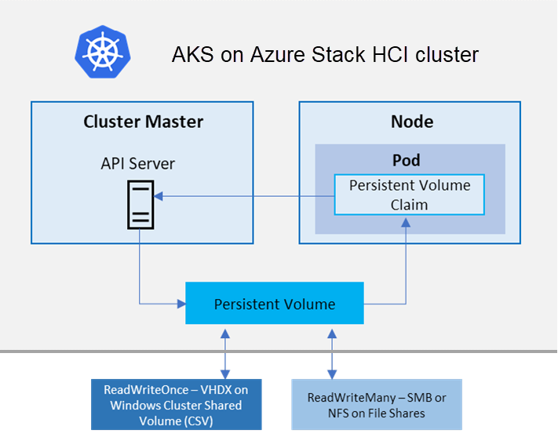

# What is AKS enabled by Azure Arc?

Azure Kubernetes Service (AKS) enabled by Azure Arc is a managed Kubernetes service that you can use to deploy and manage containerized applications on-premises, in datacenters, or at edge locations such as retail stores or manufacturing plants. You need minimal Kubernetes expertise to get started with AKS. AKS reduces the complexity and operational overhead of managing Kubernetes by offloading much of that responsibility to Azure. AKS is an ideal platform for deploying and managing containerized applications that require high availability, scalability, and portability. It's also ideal for deploying applications to multiple locations, using open-source tools, and integrating with existing DevOps tools.

## When to use AKS enabled by Azure Arc

The following list describes some of the common use cases for AKS, but is not an exhaustive list:

- **Hybrid cloud deployments**: Ideal for organizations looking to run applications across multiple environments, including on-premises and Azure, while maintaining a consistent management layer.
- **Edge computing**: Useful for deploying applications at the edge, where low latency and local processing are critical, such as in retail stores, manufacturing floors, or remote locations.
- **Regulatory and compliance**: Helps to meet specific regulatory and compliance requirements by enabling localized deployment and management of Kubernetes clusters.

## AKS enabled by Azure Arc deployment options

Azure provides you differernt options to install AKS enabled by Azure Arc Clusters. The below are the differrent environments that you can use : 

- **[AKS on Azure Stack HCI 23H2](https://learn.microsoft.com/en-us/azure/aks/hybrid/aks-whats-new-23h2)**: AKS on Azure Stack HCI 23H2 uses Azure Arc to create new Kubernetes clusters on Azure Stack HCI directly from Azure. It enables you to use familiar tools like the Azure portal and Azure Resource Manager templates to create and manage your Kubernetes clusters running on Azure Stack HCI.
- **AKS Edge Essentials**: AKS Edge Essentials includes a lightweight Kubernetes distribution with a small footprint and simple installation experience, making it easy for you to deploy Kubernetes on PC-class or "light" edge hardware.
- **AKS on Windows Server**: Azure Kubernetes Service on Windows Server (and on Azure Stack HCI 22H2) is an on-premises Kubernetes implementation of AKS that automates running containerized applications at scale, using Windows PowerShell and Windows Admin Center. It simplifies deployment and management of AKS on Windows Server 2019/2022 Datacenter and Azure Stack HCI 22H2.
- **AKS on VMWare (preview)**: AKS on VMware (preview) enables you to use Azure Arc to create new Kubernetes clusters on VMware vSphere. With AKS on VMware, you can manage your AKS clusters running on VMware vSphere using familiar tools like Azure CLI.

See the following deployment option overviews on our public documents : 

- [AKS on Azure Stack HCI 23H2](https://learn.microsoft.com/en-us/azure/aks/hybrid/aks-whats-new-23h2)
- [AKS on Windows Server](https://learn.microsoft.com/en-us/azure/aks/hybrid/overview)
- [AKS Edge Essentials](https://learn.microsoft.com/en-us/azure/aks/hybrid/aks-edge-overview)
- [AKS on VMware (preview)](https://learn.microsoft.com/en-us/azure/aks/hybrid/aks-vmware-overview)