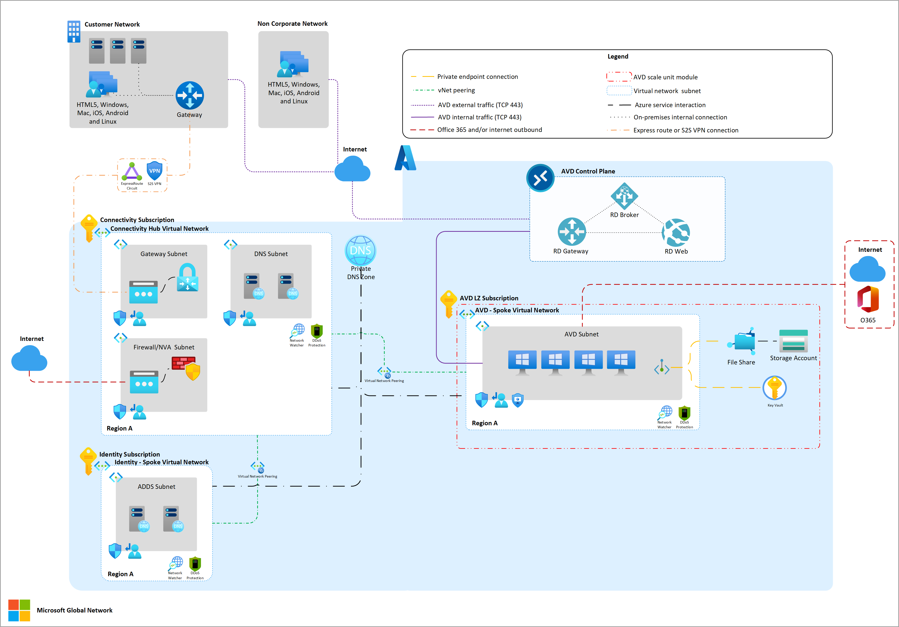

# Azure Virtual Desktop Welcome Kit

## Getting Started

- [Prerequisites](https://learn.microsoft.com/azure/virtual-desktop/prerequisites?tabs=portal)
- [Terminology](https://learn.microsoft.com/azure/virtual-desktop/terminology)
- [AVD Design](https://learn.microsoft.com/azure/virtual-desktop/service-architecture-resilience)
- [What is AVD](https://learn.microsoft.com/azure/virtual-desktop/overview)
- [Understanding AVD Network Connectivity](https://learn.microsoft.com/azure/virtual-desktop/network-connectivity)
- [Network Topology for AVD](https://learn.microsoft.com/azure/cloud-adoption-framework/scenarios/azure-virtual-desktop/eslz-network-topology-and-connectivity)
- [Identity and Access Management](https://learn.microsoft.com/azure/cloud-adoption-framework/scenarios/azure-virtual-desktop/eslz-identity-and-access-management)
- [Resource Organization](https://learn.microsoft.com/azure/cloud-adoption-framework/scenarios/azure-virtual-desktop/eslz-resource-organization)
- [Enterprise Enrollment](https://learn.microsoft.com/azure/cloud-adoption-framework/scenarios/azure-virtual-desktop/eslz-enterprise-enrollment)
- [Plan for IP Address](https://learn.microsoft.com/azure/cloud-adoption-framework/ready/azure-best-practices/plan-for-ip-addressing)
- [VM Sizing Guide](https://learn.microsoft.com/windows-server/remote/remote-desktop-services/virtual-machine-recs?toc=%2Fazure%2Fvirtual-desktop%2Ftoc.json&bc=%2Fazure%2Fvirtual-desktop%2Fbreadcrumb%2Ftoc.json)
- [Windows App](https://learn.microsoft.com/windows-app/get-started-connect-devices-desktops-apps?tabs=windows-avd%2Cwindows-w365%2Cwindows-devbox%2Cmacos-rds%2Cmacos-pc&pivots=azure-virtual-desktop)

## Image Management

- [Custom Image Templates](https://learn.microsoft.com/azure/virtual-desktop/custom-image-templates)
- [Creating Custom Image Templates](https://learn.microsoft.com/azure/virtual-desktop/create-custom-image-templates)
- [Set up golden image in Azure](https://learn.microsoft.com/azure/virtual-desktop/create-custom-image-templates)
- [VHD Image for AVD](https://learn.microsoft.com/azure/virtual-desktop/set-up-customize-master-image)
- [App Attach](https://learn.microsoft.com/azure/virtual-desktop/app-attach-overview?pivots=app-attach)
- [Deploying apps with Intune](https://learn.microsoft.com/mem/intune/fundamentals/azure-virtual-desktop-multi-session#application-deployment)

## Azure Virtual Desktop Infrastructure

- [AVD Agent](https://learn.microsoft.com/azure/virtual-desktop/agent-overview))
- [Load Balancing Methods](https://learn.microsoft.com/azure/virtual-desktop/host-pool-load-balancing)
- [Customize RDP Properties](https://learn.microsoft.com/azure/virtual-desktop/customize-rdp-properties)
- [Scheduled Agent Updates](https://learn.microsoft.com/azure/virtual-desktop/scheduled-agent-updates)
- [AutoScaling Session Hosts](https://learn.microsoft.com/azure/virtual-desktop/autoscale-scenarios)
- [Configure device redirection](https://learn.microsoft.com/azure/virtual-desktop/configure-device-redirections)
- [Start VM on Connect](https://learn.microsoft.com/azure/virtual-desktop/start-virtual-machine-connect?tabs=azure-portal)
- [AVD with Intune](https://learn.microsoft.com//mem/intune/fundamentals/azure-virtual-desktop)

## FsLogix

- [Storage Options for FSLogix](https://learn.microsoft.com/azure/virtual-desktop/store-fslogix-profile)
- [FSLogix with Azure Files](https://learn.microsoft.com/azure/virtual-desktop/fslogix-containers-azure-files)
- [FSLogix with NetApp](https://learn.microsoft.com/azure/virtual-desktop/create-fslogix-profile-container)
- [Azure Files and AD](https://learn.microsoft.com/azure/virtual-desktop/fslogix-profile-container-configure-azure-files-active-directory?tabs=adds)
- [Azure Files and Entra ID](https://learn.microsoft.com/azure/virtual-desktop/fslogix-profile-container-configure-azure-files-active-directory?tabs=adds)

## Security

- [Apply Zero-Trust principals](https://learn.microsoft.com/security/zero-trust/azure-infrastructure-avd?context=%2Fazure%2Fvirtual-desktop%2Fcontext%2Fcontext)
- [AVD Security Baseline](https://learn.microsoft.com/azure/virtual-desktop/security-recommendations#recommended-security-boundaries-for-azure-virtual-desktop-scenarios)
- [Screen Capture Protection](https://learn.microsoft.com/azure/virtual-desktop/screen-capture-protection)
- [Watermarking](https://learn.microsoft.com/azure/virtual-desktop/watermarking?tabs=intune)
- [Clipboard redirection](https://learn.microsoft.com/azure/virtual-desktop/clipboard-transfer-direction-data-types?tabs=intune)
- [Azure Firewall with AVD](https://learn.microsoft.com/azure/firewall/protect-azure-virtual-desktop?context=%2Fazure%2Fvirtual-desktop%2Fcontext%2Fcontext)
- [Azure Private Link](https://learn.microsoft.com/azure/virtual-desktop/private-link-setup?tabs=portal%2Cportal-2)
- [Security and Governance](https://learn.microsoft.com/azure/cloud-adoption-framework/scenarios/azure-virtual-desktop/eslz-security-governance-and-compliance)

## Monitoring

- [AVD Insights Glossary](https://learn.microsoft.com/azure/virtual-desktop/insights-glossary)
- [Analyze Connection Quality](https://learn.microsoft.com/azure/virtual-desktop/connection-latency)
- [Enable Insights](https://learn.microsoft.com/azure/virtual-desktop/insights?tabs=monitor)
- [Use Cases](https://learn.microsoft.com/azure/virtual-desktop/insights-use-cases)

## Infrastructure-as-Code

- [AVD Accelerator](https://github.com/Azure/avdaccelerator)
- [AVD LZ Management Plane - Terraform](https://registry.terraform.io/modules/Azure/avm-ptn-avd-lza-managementplane/azurerm/latest)
- [AVD App Groups - Terraform](https://registry.terraform.io/modules/Azure/avm-res-desktopvirtualization-applicationgroup/azurerm/latest)
- [AVD Workspace - Terraform](https://registry.terraform.io/modules/Azure/avm-res-desktopvirtualization-workspace/azurerm/latest)
- [AVD Scaling Plan - Terraform](https://registry.terraform.io/modules/Azure/avm-res-desktopvirtualization-scalingplan/azurerm/latest)
- [AVD LZ Insights - Terraform](https://registry.terraform.io/modules/Azure/avm-ptn-avd-lza-insights/azurerm/latest)
- [AVD Modules - Bicep](https://github.com/Azure/bicep-registry-modules/tree/main/avm/res/desktop-virtualization)

## AVD Videos

- [Azure Academy](https://www.youtube.com/playlist?list=PL-V4YVm6AmwXGvQ46W8mHkpvm6S5IIitK)
- [How to get started FAST AVD for Beginners](https://learn.microsoft.com/shows/learn-live/fasttrack-for-azure-season-2-ep08-how-to-get-started-fast-azure-virtual-desktop-for-beginners/)