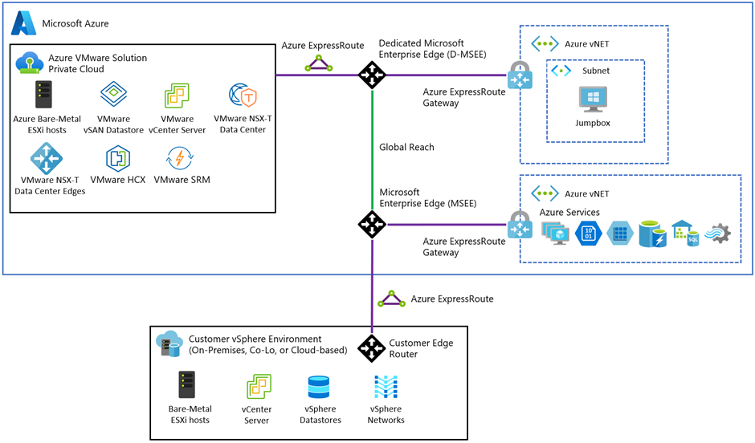

# FastTrack for Azure - Azure VMware Solution - Welcome Kit

Welcome to the ultimate guide for Azure VMware Solution enthusiasts! Whether you are embarking on setting up a brand new software defined data center or expanding an existing one, you have arrived at the right place. Understanding the complexity and the need for a reliable, flexible infrastructure, we have curated an extensive collection of resources specifically designed for Azure VMware Solution.

This Welcome Kit is structured into the following categories (or phases):

[Architecture \& Design](#architecture--design)  
[Plan](#plan)  
[Prepare](#prepare)  
[Deploy](#deploy)  
[Migrate](#migrate)  
[Govern](#govern)  
[Secure](#secure)  

## Architecture & Design

In these sections ([**design**](architectureAndDesign/design.md) and [**architecture**](architectureAndDesign/architecture.md)) we will explain the core architectural concepts for Azure VMware Solution deployments. It addresses the core concepts for Azure VMware Solution Software Defined Data Centers (SDDC) and the various services in Azure that are critical to understand Azure VMware Solution.

## Plan

In this [section](plan/plan.md) we will explain the fundamental concepts that are relevant to all planning session when considering an Azure VMware Solution [deployment](deploy/deploy.md)

## Prepare  

In this [section](prepare/prepare.md) we will explain the fundamental concepts that are relevant to to preparing to [deploy](deploy/deploy.md) an Azure VMware Solution implementation.

## Deploy  

In this [section](deploy/deploy.md) we will explain the options available to and highlight some key focus areas when you are ready to start deploying your Azure VMware Solution. Please do **NOT** skip here directly. [**Design**](architectureAndDesign/design.md), [**Architecture**](architectureAndDesign/architecture.md), [**Plan**](plan/plan.md) and [**Prepare**](prepare/prepare.md) are key aspects to ensure success.

## Migrate  

In this [section](migrate/migrate.md) we will explain the concepts related to the assessment of your Azure VMware Solution environment and we will explain different migration tools available to you.

## Govern  

In this [section](govern/govern.md) we will cover key aspects that should be included in all areas of your deployment, these include Governance, Business Continuity and Disaster Recovery.

## Secure  

In this [section](secure/secure.md) we will cover key aspects that should be included in all _**security related**_ areas of your deployment, these include security considerations and baselines that are applicable to Azure VMware Solution.
=======
# Azure VMware Solution Architecture

| Topic | Reference |
| ---    |  --- |
| Architectural components | • [Introduction – Azure VMware Solution](https://learn.microsoft.com/azure/azure-vmware/introduction) |
| Network & connectivity architecture(s) | • [Enterprise-scale network topology and connectivity for Azure VMware Solution – Cloud Adoption Framework](https://learn.microsoft.com/azure/cloud-adoption-framework/scenarios/azure-vmware/eslz-network-topology-connectivity) |
| Service Level Agreement requirements | • [Licensing Documents (microsoft.com)](https://www.microsoft.com/licensing/docs/view/Service-Level-Agreements-SLA-for-Online-Services?lang=1) – **Download the latest version available and search for “Azure VMware Solution”** |

## Azure VMware Solution Design

| **Topic**                                          | **Reference**                                                                                                                                                                                                                                                                                                                                                                                                                                                                                                                                                                                                                      |
|-----------------|-------------------------------------------------------|
| Azure VMware Solution Azure Landing Zone Checklist | • [Azure/review-checklists](https://github.com/Azure/review-checklists)                                                                                                                                                                                                                                                                                                                                                                                                                                                                                                                                                               |
| SDDC & cluster design considerations               | • [Private clouds and clusters – Azure VMware Solution](https://learn.microsoft.com/azure/azure-vmware/concepts-private-clouds-clusters) • [Deploy vSAN stretched clusters – Azure VMware Solution](https://learn.microsoft.com/azure/azure-vmware/deploy-vsan-stretched-clusters)                                                                                                                                                                                                                                                                                                                                        |
| BCDR considerations                                | • [Enterprise-scale BCDR for Azure VMware Solution – Cloud Adoption Framework](https://learn.microsoft.com/azure/cloud-adoption-framework/scenarios/azure-vmware/eslz-business-continuity-and-disaster-recovery)                                                                                                                                                                                                                                                                                                                                                                                                                |
| Connectivity design considerations                 | • [Enterprise-scale example architectures connectivity to Azure VMware Solution – Cloud Adoption Framework](https://learn.microsoft.com/azure/cloud-adoption-framework/scenarios/azure-vmware/example-architectures) • [Network Design Guide for Azure VMware Solution – Microsoft Community Hub](https://techcommunity.microsoft.com/t5/itops-talk-blog/network-design-guide-for-azure-vmware-solution/ba-p/3832546)                                                                                                                                                                                                           |
| Identity & Access Management considerations        | • [Enterprise-scale identity and access management – Azure VMware Solution – Cloud Adoption Framework](https://learn.microsoft.com/azure/cloud-adoption-framework/scenarios/azure-vmware/eslz-identity-and-access-management) • [Configure LDAPS within Azure VMware Solution – Microsoft Community Hub](https://techcommunity.microsoft.com/t5/fasttrack-for-azure/configure-ldaps-within-azure-vmware-solution/ba-p/3725759)                                                                                                                                                                                                  |
| Storage considerations                             | •[Management and monitoring for Azure VMware Solution – Cloud Adoption Framework](https://learn.microsoft.com/azure/cloud-adoption-framework/scenarios/azure-vmware/eslz-management-and-monitoring#storage-considerations) • [Storage – Azure VMware Solution](https://learn.microsoft.com/azure/azure-vmware/concepts-storage)                                                                                                                                                                                                                                                                                           |
| Security considerations                            | • [Security recommendations for Azure VMware Solution – Azure VMware Solution](https://learn.microsoft.com/azure/azure-vmware/concepts-security-recommendations) • [Azure security baseline for Azure VMware Solution](https://learn.microsoft.com/security/benchmark/azure/baselines/azure-vmware-solution-security-baseline?toc=%2Fazure%2Fazure-vmware%2Ftoc.json) • [Security, governance, and compliance disciplines for Azure VMware Solution – Cloud Adoption Framework](https://learn.microsoft.com/azure/cloud-adoption-framework/scenarios/azure-vmware/eslz-security-governance-and-compliance#security) |

**Azure VMware Solution Management and Operations**

| **Topic**                             | **Reference**                                                                                                                                                                                                                                                                                                                                                                                                                                                                                                                                                                                  |
|----------------|--------------------------------------------------------|
| Hybrid management considerations      | • [Azure Arc-enabled servers Overview – Azure Arc](https://learn.microsoft.com/azure/azure-arc/servers/overview)                                                                                                                                                                                                                                                                                                                                                                                                                                                                         |
| Governance considerations             | • [Azure VMware Solution – Platform management](https://learn.microsoft.com/azure/azure-vmware/faq#how-often-is-the-vmware-solution-software--esxi--vcenter-server--nsx-t-data-center--patched--updated--or-upgraded-in-the-azure-vmware-solution-private-cloud)• [Security, governance, and compliance disciplines for Azure VMware Solution – Cloud Adoption Framework](https://learn.microsoft.com/azure/cloud-adoption-framework/scenarios/azure-vmware/eslz-security-governance-and-compliance#governance)                                                                    |
| Log management considerations         | • [Configure VMware syslogs for Azure VMware Solution – Azure VMware Solution](https://learn.microsoft.com/azure/azure-vmware/configure-vmware-syslogs)• [Management and monitoring for Azure VMware Solution – Cloud Adoption Framework](https://learn.microsoft.com/azure/cloud-adoption-framework/scenarios/azure-vmware/eslz-management-and-monitoring#azure-tooling-recommendations)                                                                                                                                                                                          |
| Performance monitoring considerations | • [Configure alerts and work with metrics in Azure VMware Solution – Azure VMware Solution](https://learn.microsoft.com/azure/azure-vmware/configure-alerts-for-azure-vmware-solution)• [Management and monitoring for Azure VMware Solution – Cloud Adoption Framework](https://learn.microsoft.com/azure/cloud-adoption-framework/scenarios/azure-vmware/eslz-management-and-monitoring#azure-tooling-recommendations)                                                                                                                                                           |
| Alerting considerations               | • [Management and monitoring for Azure VMware Solution – Cloud Adoption Framework](https://learn.microsoft.com/azure/cloud-adoption-framework/scenarios/azure-vmware/eslz-management-and-monitoring#azure-tooling-recommendations)                                                                                                                                                                                                                                                                                                                                                       |
| Elevated operations (run-commands)    | • [Concepts – Run Command in Azure VMware Solution (Preview) – Azure VMware Solution](https://learn.microsoft.com/azure/azure-vmware/concepts-run-command)                                                                                                                                                                                                                                                                                                                                                                                                                               |
| Azure VMware Solution Design Series   | • [Azure VMware Solution Availability Design Considerations](https://techcommunity.microsoft.com/t5/azure-migration-and/azure-vmware-solution-availability-design-considerations/ba-p/3682915) • [Azure VMware Solution Recoverability Design Considerations](https://techcommunity.microsoft.com/t5/azure-migration-and/azure-vmware-solution-recoverability-design-considerations/ba-p/3746509) • [Azure VMware Solution Performance Design Considerations](https://techcommunity.microsoft.com/t5/azure-migration-and/azure-vmware-solution-performance-design-considerations/ba-p/3903291) |

## Azure VMware Solution Migrate

### ASSESSMENT

| **Topic**                               | **Reference**                                                                                                                                                                                                                                                                                                  |
|-------------------|-----------------------------------------------------|
| Migration Assessment with Azure Migrate | • [Create an Azure VMware Solution assessment with Azure Migrate – Azure Migrate](https://learn.microsoft.com/azure/migrate/how-to-create-azure-vmware-solution-assessment)                                                                                                                              |
| RVTools                                 | • [Azure VMware Solution capacity planning – Azure Solution Ideas](https://learn.microsoft.com/azure/architecture/solution-ideas/articles/azure-vmware-solution-foundation-capacity#discovery)• [RVTools – The Ultimate free VMware Tool you need to have!](https://www.youtube.com/watch?v=2A-fOuNQWKc) |

### MIGRATION TOOLING

| **Topic**       | **Reference**                                                                                                                                                                                                                   |
|-------------|-----------------------------------------------------------|
| HCX             | • [Move on-premises VMware infrastructure to Azure VMWare Solution – Cloud Adoption Framework](https://learn.microsoft.com/azure/cloud-adoption-framework/migrate/azure-best-practices/contoso-migration-vmware-to-azure) |
| Zerto           | • [Zerto on Microsoft Azure – Data Protection & Recovery – Zerto](https://www.zerto.com/solutions/use-cases/cloud/microsoft-azure/)                                                                                             |
| Veeam           | • [KB4012: Azure VMware Solution Support – Considerations and Limitations (veeam.com)](https://www.veeam.com/kb4012)                                                                                                            |
| Deploying HCX   | • [Install and activate VMware HCX in Azure VMware Solution – Azure VMware Solution](https://learn.microsoft.com/azure/azure-vmware/install-vmware-hcx)                                                                   |
| Configuring HCX | • [Configure VMware HCX in Azure VMware Solution – Azure VMware Solution](https://learn.microsoft.com/azure/azure-vmware/configure-vmware-hcx)                                                                            |

### Other tools and links

| **Topic**                      | **Reference**                                                                                                               |
|---------------------------------|---------------------------------------|
| Azure VMware Solution Road map | • [Azure updates – Azure VMware Solution](https://azure.microsoft.com/updates/?query=%22azure%20vmware%20solution%22) |
